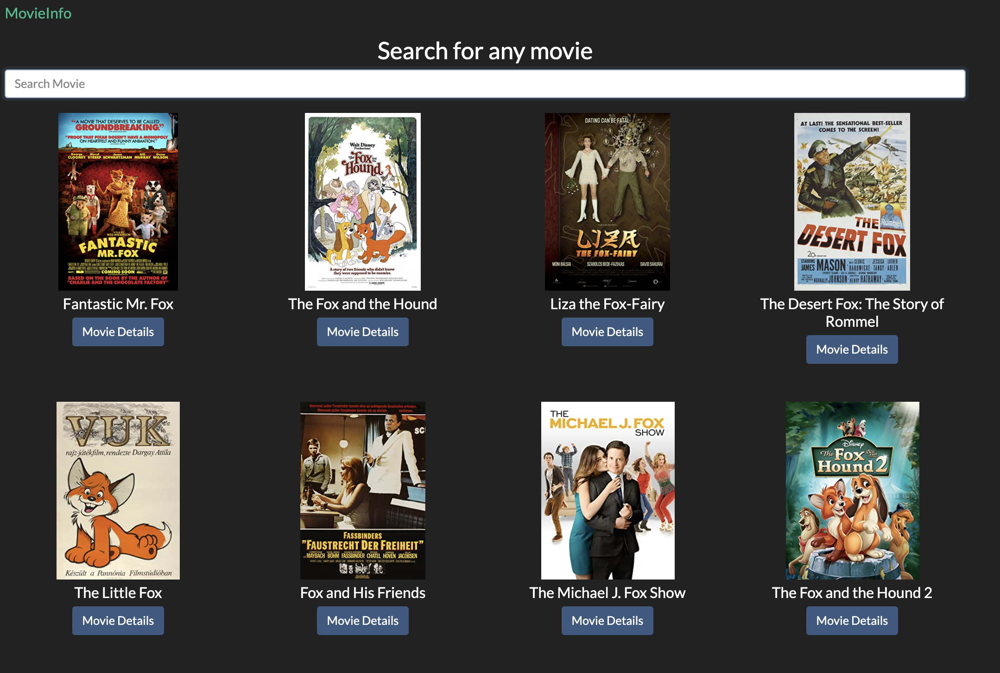

# movie-finder

This app uses the OMBDb API to find movies.

## Table of Contents

- [Deployment](#deployment)
- [Usage](#usage)
- [Technologies](#technologies)
- [Lessons](#lessons)
- [Credits](#credits)
- [License](#license)

## Deployment

[Deployment](https://anusontarangkul.github.io/movie-finder/)
This app is deployed using GitHub Pages.

## Usage

You can search movies in the search field. Once you enter, the app will make an AJAX GET call to the OMDb API. The matching movies will be dynamically rendered in a boostrap grid. You are able to look at more information about the movie. You can also view the information on IMDB as well.

## Technologies

### Languages

- HTML
- CSS
- JavaScript

#### Libraries

- jQuery
- Bootswatch

#### APIs

- [OMDb](https://www.omdbapi.com/)

## Lessons

- How to use the AJAX call in jQuery.
- How to use the OMDb API.
- How to use Bootswatch.

## Credits

David Anusontarangkul

[ LinkedIn](https://www.linkedin.com/in/anusontarangkul/)
[ GitHub](https://github.com/anusontarangkul)

This project was apart of a YouTube [tutorial](https://www.youtube.com/watch?v=YsPqjYGauns) by [Traversy](https://www.youtube.com/channel/UC29ju8bIPH5as8OGnQzwJyA)

## License

Copyright <2021> <Anusontarangkul>

Permission is hereby granted, free of charge, to any person obtaining a copy of this software and associated documentation files (the "Software"), to deal in the Software without restriction, including without limitation the rights to use, copy, modify, merge, publish, distribute, sublicense, and/or sell copies of the Software, and to permit persons to whom the Software is furnished to do so, subject to the following conditions:

The above copyright notice and this permission notice shall be included in all copies or substantial portions of the Software.

THE SOFTWARE IS PROVIDED "AS IS", WITHOUT WARRANTY OF ANY KIND, EXPRESS OR IMPLIED, INCLUDING BUT NOT LIMITED TO THE WARRANTIES OF MERCHANTABILITY, FITNESS FOR A PARTICULAR PURPOSE AND NONINFRINGEMENT. IN NO EVENT SHALL THE AUTHORS OR COPYRIGHT HOLDERS BE LIABLE FOR ANY CLAIM, DAMAGES OR OTHER LIABILITY, WHETHER IN AN ACTION OF CONTRACT, TORT OR OTHERWISE, ARISING FROM, OUT OF OR IN CONNECTION WITH THE SOFTWARE OR THE USE OR OTHER DEALINGS IN THE SOFTWARE.
